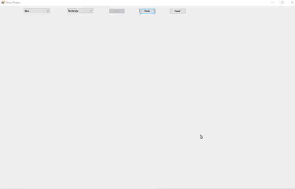

# Draw-Shapes

This is the first project that I worked on when learning C#. It's a Windows Forms Application which allows the user to draw shapes in various colors on a canvas. It comes with functioning undo, redo, and reset buttons.
